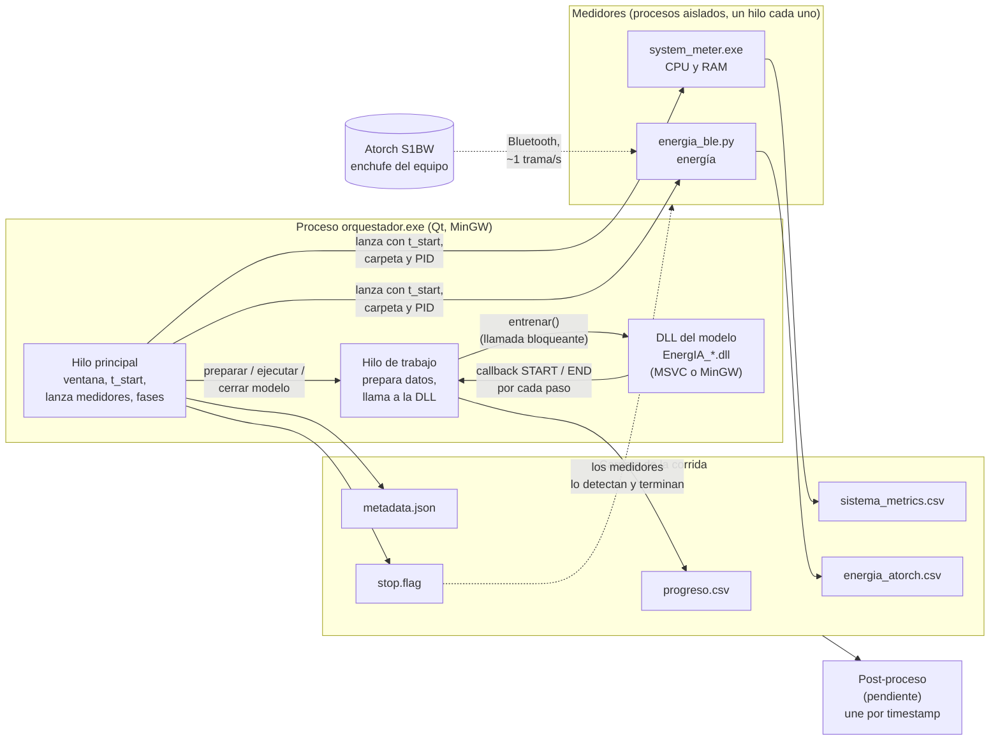
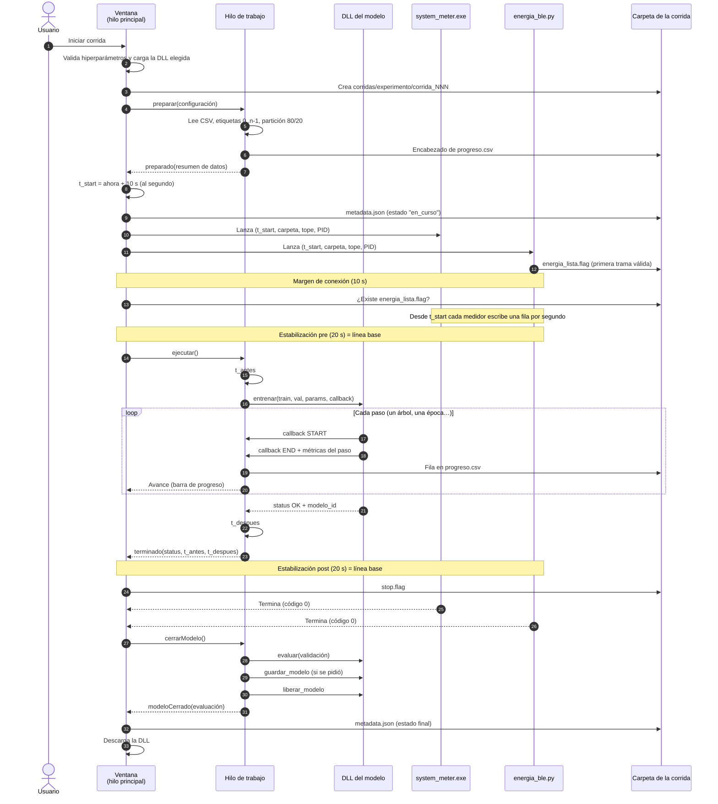
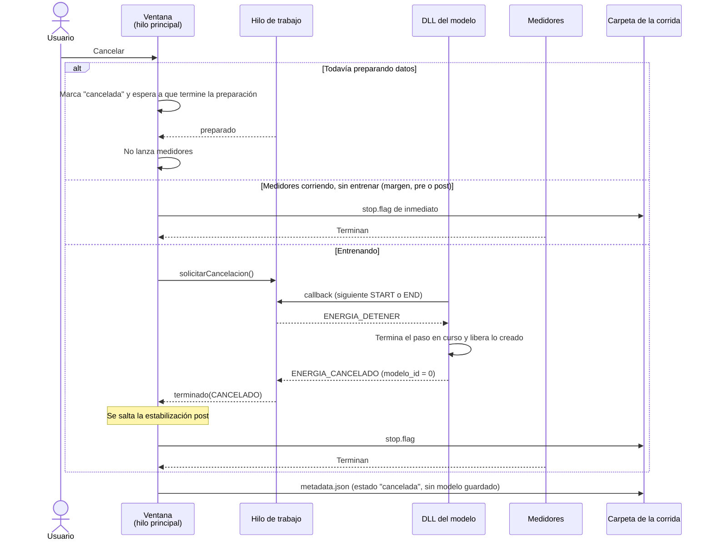
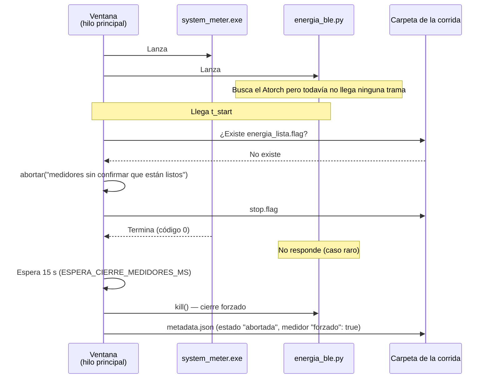
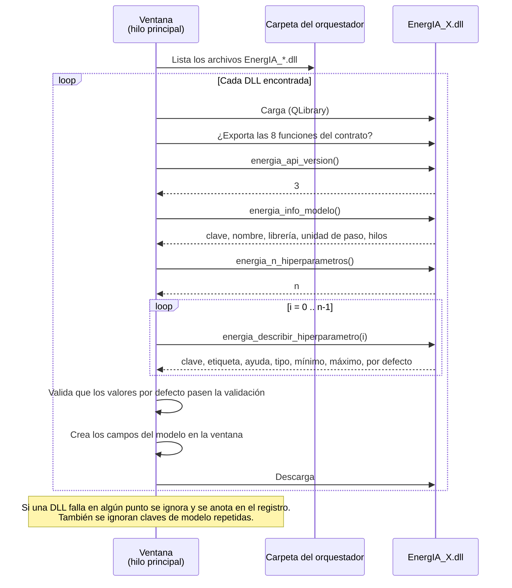
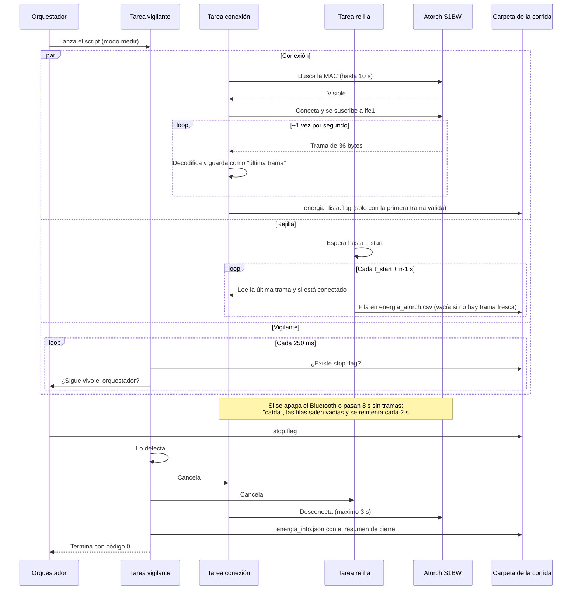
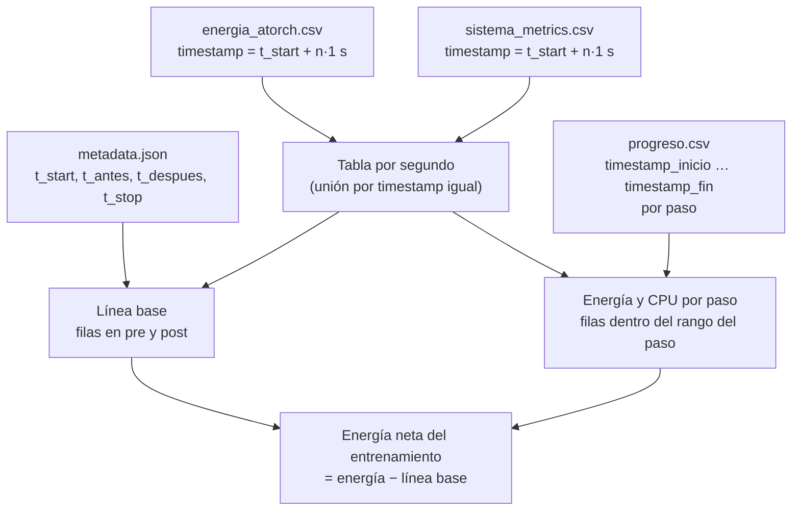

# EnergIA — Documentación del sistema de medición

EnergIA mide cuánta energía y cuánto cómputo (CPU y RAM) consume entrenar un modelo de aprendizaje automático. El sistema entrena el modelo en el computador mientras un medidor físico (Atorch S1BW, conectado por Bluetooth entre el enchufe y el cargador del equipo) registra la potencia eléctrica, y un segundo medidor registra el uso de CPU y RAM. Al final de cada corrida quedan varios archivos con marcas de tiempo comunes, de modo que se puede saber cuánta energía se gastó en cada etapa del entrenamiento.

Este documento explica qué hay hoy en el repositorio, cómo funciona cada pieza, por qué se construyó así y cómo ponerlo a correr en otro computador.

> Estado del repositorio: primer commit (25 de septiembre de 2026). Funcionan el orquestador, los dos medidores, una DLL de prueba y la DLL del árbol de decisión con mlpack. Faltan la red neuronal (MLP con libtorch) y el Random Forest.

## Contenido

1. [Glosario](#1-glosario)
2. [Qué hay hoy](#2-qué-hay-hoy)
3. [Estructura del repositorio](#3-estructura-del-repositorio)
4. [Arquitectura general](#4-arquitectura-general)
5. [Cómo funciona una corrida](#5-cómo-funciona-una-corrida)
6. [Componentes](#6-componentes)
7. [Relación con el código de Juan Diego](#7-relación-con-el-código-de-juan-diego)
8. [Qué produce cada corrida](#8-qué-produce-cada-corrida)
9. [Primeros resultados](#9-primeros-resultados)
10. [Qué falta](#10-qué-falta)
11. [Cómo compilarlo y correrlo](#11-cómo-compilarlo-y-correrlo)

---

## 1. Glosario

| Término | Qué significa en EnergIA |
|---|---|
| **Corrida** | Un entrenamiento completo con su medición. Cada clic en "Iniciar corrida" produce una carpeta `corridas/<experimento>/corrida_NNN`. |
| **Experimento** | Un nombre que agrupa varias corridas (por ejemplo, el mismo modelo con los mismos datos repetido varias veces). |
| **Orquestador** | El programa con ventana (`orquestador.exe`, hecho en Qt). Coordina todo: prepara los datos, lanza los medidores, llama al entrenamiento y escribe el resumen. |
| **DLL** | Biblioteca de Windows que contiene el código de un modelo. Hay una DLL por modelo (`EnergIA_Arbol.dll`, `EnergIA_Prueba.dll`, …). El orquestador las carga mientras corre, sin necesidad de recompilarlo. |
| **Contrato** | El conjunto fijo de funciones y estructuras que toda DLL de modelo debe exponer (`energia_dll.h`). Si una DLL cumple el contrato, el orquestador la puede usar. |
| **Medidor** | Programa independiente que mide algo y lo escribe en un CSV: `system_meter.exe` (CPU y RAM) y `energia_ble.py` (energía del Atorch). |
| **`t_start`** | Instante común de arranque que el orquestador calcula una sola vez y entrega a todos los medidores. Desde ahí todos escriben sobre la misma rejilla de tiempo. |
| **Rejilla** | Los instantes `t_start`, `t_start + 1 s`, `t_start + 2 s`, … Cada medidor escribe una fila en cada punto de la rejilla, así las filas de energía y de sistema se pueden unir por igualdad de timestamp. |
| **Línea base** | Consumo del equipo cuando no está entrenando. Se mide 20 s antes y 20 s después del entrenamiento (estabilización pre y post). |
| **Paso** | Unidad de avance del entrenamiento: un árbol en un bosque, una época en una red neuronal. Un árbol de decisión individual tiene un solo paso. |
| **Callback** | Función del orquestador que la DLL llama al empezar (`START`) y al terminar (`END`) cada paso. Así queda registrado cuándo empezó y terminó cada paso. |
| **`stop.flag`** | Archivo que el orquestador crea en la carpeta de la corrida para avisar a los medidores que deben terminar. |
| **`t_antes` / `t_despues`** | Marcas de tiempo tomadas justo antes y justo después de la llamada de entrenamiento. Delimitan exactamente cuánto duró el entrenamiento. |

---

## 2. Qué hay hoy

| Pieza | Archivo | Estado |
|---|---|---|
| Orquestador (ventana Qt) | `orquestador.cpp` | Funciona |
| Contrato de las DLL (versión 3) | `energia_dll.h` | Funciona |
| Ayudas compartidas por DLL y orquestador | `energia_comun.h` | Funciona |
| DLL de prueba (modelo simulado) | `energia_dll_stub.cpp` → `EnergIA_Prueba.dll` | Funciona |
| DLL del árbol de decisión (mlpack) | `dlls/energia_arbol.cpp` → `EnergIA_Arbol.dll` | Funciona, probada con HEPMASS |
| Medidor de CPU y RAM | `system_meter.cpp` → `system_meter.exe` | Funciona |
| Medidor de energía (Atorch S1BW por Bluetooth) | `medidores/energia_ble.py` | Funciona |
| DLL de la red neuronal (MLP con libtorch) | — | Pendiente |
| DLL del Random Forest | — | Pendiente |
| Post-proceso (cálculo de energía por paso) y auditoría de corridas | — | Pendiente |

Todo está probado en Windows 11 de 64 bits con Qt 6.11.2 (kit MinGW 13.1.0), Python 3.13 y Visual Studio 18 Insiders (MSVC 19.51) para las DLL de modelos.

---

## 3. Estructura del repositorio

```
Back-EnergIA/
├── CMakeLists.txt          Compila el orquestador, system_meter.exe y la DLL de prueba (MinGW, desde Qt Creator)
├── orquestador.cpp         Orquestador: ventana, hilos, línea de tiempo de la corrida, metadata.json
├── energia_dll.h           Contrato entre el orquestador y las DLL de modelos (versión 3)
├── energia_comun.h         Validación de hiperparámetros y utilidades comunes (no es parte del contrato)
├── energia_dll_stub.cpp    DLL de prueba: simula pasos con carga real de CPU, sin librerías externas
├── system_meter.cpp        Medidor de CPU y RAM (WinAPI + PDH)
├── dlls/                   DLL de modelos reales, compiladas aparte con MSVC
│   ├── CMakeLists.txt      Compilación de las DLL (mismas opciones para todas)
│   ├── vcpkg.json          Dependencias: mlpack, Armadillo, cereal, ensmallen
│   ├── compilar_dlls.bat   Doble clic: prepara MSVC, descarga vcpkg, compila y copia las DLL a bin/
│   └── energia_arbol.cpp   Árbol de decisión con mlpack
└── medidores/
    ├── energia_ble.py      Medidor de energía (Atorch S1BW por Bluetooth)
    ├── requirements.txt    Dependencias de Python (bleak y sus paquetes de Windows)
    └── crear_entorno.bat   Crea el entorno virtual medidores/venv con esas dependencias
```

Lo que **no** está en el repositorio y se genera al compilar o al correr:

```
build/<kit de Qt>/bin/
├── orquestador.exe
├── system_meter.exe
├── EnergIA_Prueba.dll
├── EnergIA_Arbol.dll       (la copia compilar_dlls.bat)
├── compilacion_dlls.txt    (cómo se compilaron las DLL: compilador, opciones, triplet)
└── corridas/
    └── <experimento>/
        ├── corrida_001/
        └── corrida_002/
medidores/venv/             (entorno de Python, lo crea crear_entorno.bat)
dlls/vcpkg/, dlls/build/    (los crea compilar_dlls.bat)
```

---

## 4. Arquitectura general

El sistema tiene tres procesos que corren al mismo tiempo durante una corrida: el orquestador y los dos medidores. Los medidores no hablan con el orquestador ni entre sí: solo reciben el mismo `t_start` al arrancar y escriben cada uno su propio archivo. La relación entre los datos (qué energía corresponde a qué paso del entrenamiento) se calcula después, uniendo los archivos por marca de tiempo.



### Por qué así

- **Los medidores son procesos aparte, no hilos del orquestador.** Si la DLL del modelo falla y tumba el orquestador, los medidores siguen vivos y lo ya medido queda guardado en disco. Además, cada medidor puede estar hecho en la tecnología que mejor le sirva (C++ para el de sistema, Python para el Bluetooth): lo único fijo es el formato de sus archivos. Se descartó juntarlos en un solo programa por esas dos razones.
- **La DLL corre dentro del orquestador, en un hilo propio.** El hilo principal no se bloquea (la ventana sigue respondiendo y se puede cancelar), y el hilo de trabajo puede tomar `t_antes` y `t_despues` justo alrededor de la llamada, sin nada en medio.
- **La relación entre pasos y energía se calcula después, no en vivo.** Hacerlo en vivo obligaría a que los medidores hablaran con el orquestador, y eso rompería el aislamiento anterior.
- **La DLL se carga mientras el programa corre (con `QLibrary`), no al compilar.** Esto permite que el orquestador se compile con MinGW (el compilador que trae Qt) y las DLL de modelos con MSVC (el que necesita libtorch), y que un modelo nuevo aparezca en la ventana solo con copiar su DLL a la carpeta, sin recompilar el orquestador.

---

## 5. Cómo funciona una corrida

### 5.1 Línea de tiempo

```mermaid
flowchart LR
    A["Preparar datos<br/>(antes de medir)"] --> B["Margen de conexión<br/>10 s"]
    B --> C(["t_start"])
    C --> D["Estabilización pre<br/>20 s<br/>línea base"]
    D --> E(["t_antes"])
    E --> F["Entrenamiento<br/>(DLL)"]
    F --> G(["t_despues"])
    G --> H["Estabilización post<br/>20 s<br/>línea base"]
    H --> I(["stop.flag"])
    I --> J["Medidores cierran<br/>(máx. 15 s)"]
    J --> K["Evaluar, guardar<br/>y liberar modelo<br/>(fuera de la medición)"]
    K --> L["metadata.json<br/>final"]
```



En palabras:

1. **Preparar datos.** El orquestador lee el CSV (o genera datos sintéticos de prueba), convierte las etiquetas a `0..n-1` y parte los datos en entrenamiento y validación. Esto pasa **antes** de lanzar los medidores, porque leer un CSV grande tarda (con HEPMASS, 7 millones de filas, tarda un minuto) y no debe mezclarse con la medición.
2. **Margen de conexión (10 s).** Se lanzan los dos medidores y se les da tiempo de arrancar y, en el caso del Bluetooth, de conectarse al Atorch. `t_start` se calcula como "ahora + 10 s", redondeado al siguiente segundo entero.
3. **`t_start`.** El orquestador revisa que el medidor de energía ya haya recibido datos (archivo `energia_lista.flag`). Si no, aborta la corrida antes de entrenar. Desde `t_start`, los dos medidores escriben una fila por segundo.
4. **Estabilización pre (20 s).** El equipo está quieto: sirve para medir la línea base.
5. **Entrenamiento.** El hilo de trabajo toma `t_antes`, llama a `entrenar()` de la DLL (la llamada no retorna hasta que termina) y toma `t_despues`. Durante el entrenamiento, cada paso queda registrado en `progreso.csv` con su inicio y su fin.
6. **Estabilización post (20 s).** Otra vez el equipo quieto, para una segunda medida de línea base. Si el entrenamiento falló o se canceló, esta fase se salta.
7. **`stop.flag`.** El orquestador crea el archivo y los medidores terminan solos. Si alguno no termina en 15 s, se cierra a la fuerza.
8. **Evaluar, guardar y liberar el modelo.** Ya con los medidores detenidos, para que su costo no entre en la medición: se calcula la exactitud en validación, se guarda el modelo si se marcó la casilla, y se libera la memoria.
9. **`metadata.json`.** Resumen de la corrida: modelo, hiperparámetros, datos, tiempos, evaluación y estado de cada medidor.

Los tiempos son constantes del bloque `cfg` al inicio de `orquestador.cpp`:

| Constante | Valor | Para qué |
|---|---|---|
| `MARGEN_CONEXION_MS` | 10 000 | Tiempo para que los medidores arranquen antes de `t_start` |
| `ESTABILIZACION_PRE_MS` | 20 000 | Línea base antes del entrenamiento |
| `ESTABILIZACION_POST_MS` | 20 000 | Línea base después del entrenamiento |
| `ESPERA_CIERRE_MEDIDORES_MS` | 15 000 | Espera tras `stop.flag` antes de forzar el cierre |
| `ESPERA_ARRANQUE_MEDIDOR_MS` | 5 000 | Máximo para que un medidor arranque como proceso |
| `DURACION_MAXIMA_MEDIDORES_S` | 14 400 (4 h) | Tope de seguridad: si nunca aparece `stop.flag`, los medidores terminan igual |

### 5.2 Diagrama de secuencia: corrida normal



### 5.3 Diagrama de secuencia: cancelaciones

El botón "Cancelar" hace cosas distintas según el momento de la corrida. La cancelación durante el entrenamiento no interrumpe la DLL a la fuerza: la DLL se entera la próxima vez que llama al callback, termina el paso en curso y devuelve `ENERGIA_CANCELADO`. En el árbol de decisión, que es un solo paso, esto significa que la cancelación se atiende cuando el árbol termina de construirse.



### 5.4 Diagrama de secuencia: corrida abortada y cierre forzado

Una corrida se **aborta** cuando algo falla antes de entrenar: los datos no se pueden leer, un medidor no arranca, o el medidor de energía no confirmó que recibe datos al llegar `t_start`. También se muestra qué pasa si un medidor no responde a `stop.flag`.



Si la corrida se aborta seguido por falta de `energia_lista.flag`, la solución es subir `MARGEN_CONEXION_MS` en `orquestador.cpp`.

Los estados posibles de una corrida en `metadata.json` son:

| Estado | Cuándo |
|---|---|
| `en_curso` | Se escribe al calcular `t_start`, antes de lanzar los medidores; si queda así, el orquestador se cerró a mitad de corrida |
| `completada` | El entrenamiento terminó bien |
| `cancelada` | El usuario pulsó "Cancelar" |
| `error_dll` | La DLL devolvió un código de error |
| `abortada` | Algo falló antes de entrenar (datos, medidores, `energia_lista.flag`) |

---

## 6. Componentes

### 6.1 Orquestador (`orquestador.cpp`)

Programa con ventana hecho en Qt Widgets, en un solo archivo. Es lo único que el usuario abre.

**Lo que se elige en la ventana** (cambia en cada experimento):

| Grupo | Campos |
|---|---|
| Experimento | Nombre del experimento; casilla "Guardar el modelo al terminar" |
| Datos | Casilla "Usar datos sintéticos (prueba)" o un CSV; columna objetivo; porcentaje de entrenamiento (50–95 %, por defecto 80 %); semilla (por defecto 42) |
| Modelo | Lista de modelos (una entrada por DLL encontrada); los campos de hiperparámetros de ese modelo, que se arman solos a partir de lo que describe la DLL; botón "Buscar modelos" para volver a leer la carpeta |

Debajo están los botones "Iniciar corrida" y "Cancelar", el nombre de la fase actual, una barra de progreso por pasos y un registro de mensajes.

**Lo que queda fijo en el código** (el montaje del laboratorio, cambia poco): los tiempos de la sección 5.1, el patrón de nombre de las DLL (`EnergIA_*.dll`), la carpeta `corridas`, los comandos para lanzar cada medidor y el máximo de 100 clases.

**Datos de entrada.** El orquestador espera un CSV ya limpio: con encabezado, sin comprimir y con todas las columnas numéricas (la preparación del dataset se hace antes, fuera de EnergIA). El lector acepta separador coma, punto y coma o tabulación, coma decimal cuando el separador no es coma, el BOM que agrega Excel y campos entre comillas. Si la columna objetivo tiene más de 100 valores distintos, la corrida no arranca, porque probablemente es un problema de regresión y por ahora solo se trabaja con clasificación. Las etiquetas originales se convierten a `0..n-1` y la equivalencia queda en `metadata.json` (`clases_originales`).

**Partición entrenamiento/validación.** La hace el orquestador, no la DLL, para que los tres modelos reciban exactamente las mismas filas. Usa Fisher-Yates con el generador `mt19937` y la semilla elegida, porque da el mismo resultado sin importar con qué compilador se haya compilado.

**Datos sintéticos.** 1 500 filas, 8 columnas y 3 clases generadas con la semilla. Sirven para probar el sistema completo sin buscar un dataset.

**Búsqueda de modelos.** Al abrir la ventana (o al pulsar "Buscar modelos"), el orquestador carga cada `EnergIA_*.dll` de su carpeta, le pide que se describa, arma los campos y la vuelve a descargar. En cada corrida carga solo la DLL elegida y la descarga al terminar, para que un modelo no deje memoria ocupada al siguiente.



**Los dos hilos.** El hilo principal maneja la ventana y la línea de tiempo con temporizadores de precisión (`QTimer` con `Qt::PreciseTimer`). El hilo de trabajo (`QThread`) prepara los datos, hace la llamada bloqueante a la DLL y luego evalúa, guarda y libera el modelo. El callback de la DLL se ejecuta en el hilo de trabajo: lo primero que hace es tomar la hora, y después escribe la fila de `progreso.csv` y avisa a la ventana.

**Reloj.** Todos los tiempos se toman con `GetSystemTimePreciseAsFileTime` (reloj de pared UTC con resolución menor a un microsegundo) y se escriben como texto ISO UTC con milisegundos, por ejemplo `2026-09-22T00:52:45.334Z`. Es el mismo formato que usaba el script de Juan Diego, y es el que usan los dos medidores.

**Por qué así.**
- Lo que cambia en cada experimento está en la ventana; lo que es del laboratorio está en constantes. Se descartó pasar todo por argumentos de línea de comandos porque el uso normal es desde la ventana.
- Los hiperparámetros se validan antes de lanzar los medidores, con la misma función que usa la DLL (`energia::validarParams`, en `energia_comun.h`). Así un error de configuración aparece al instante y no después de 30 s de margen y estabilización.
- Cada clic es una corrida. Las repeticiones automáticas dentro de un experimento quedaron para después.

### 6.2 Contrato de las DLL (`energia_dll.h`, versión 3)

Es la "interfaz" que toda DLL de modelo debe cumplir. Si alguien quiere agregar un modelo nuevo, solo tiene que escribir una DLL con estas funciones: el orquestador no se toca.

**Las 8 funciones:**

| Función | Qué hace | Cuándo la llama el orquestador |
|---|---|---|
| `energia_api_version()` | Devuelve la versión del contrato con que se compiló la DLL (3) | Al buscar modelos y al cargar la DLL para una corrida |
| `energia_info_modelo(info)` | Llena la información del modelo: clave, nombre, librería y versión, unidad de paso ("árbol", "época") e hilos | Al buscar modelos |
| `energia_n_hiperparametros()` | Cuántos hiperparámetros tiene el modelo (máximo 16) | Al buscar modelos |
| `energia_describir_hiperparametro(i, out)` | Describe el hiperparámetro `i`: clave, etiqueta, texto de ayuda, tipo, rango y valor por defecto | Al buscar modelos |
| `entrenar(train, val, params, callback, user_data, &modelo_id)` | Entrena. **Bloqueante**: no retorna hasta que termina, falla o se cancela. Si sale bien, devuelve un identificador del modelo, que queda vivo dentro de la DLL | Durante la medición |
| `evaluar(modelo_id, datos, metricas, max, &n)` | Calcula métricas de calidad (al menos `val_accuracy`) sobre los datos de validación | Después de detener los medidores |
| `guardar_modelo(modelo_id, ruta)` | Escribe el modelo en un archivo (`modelo.bin`) | Después de detener los medidores, si se marcó la casilla |
| `liberar_modelo(modelo_id)` | Libera la memoria del modelo | Siempre, al final |

La función `inferir` está reservada para una versión futura. Por eso `entrenar` devuelve un identificador en vez de destruir el modelo: la idea es poder medir también la inferencia más adelante.

**Tipos de hiperparámetro** que puede describir una DLL (la ventana crea el campo adecuado para cada uno):

| Tipo | Campo en la ventana | Ejemplo |
|---|---|---|
| `ENTERO` | Número entero con mínimo y máximo | Profundidad máxima |
| `REAL` | Número decimal con mínimo y máximo | Learning rate |
| `OPCION` | Lista desplegable | Criterio: `gini;entropia` |
| `LISTA_ENTEROS` | Texto con números separados por comas | Capas ocultas: `64,32` |

**El callback de progreso.** La DLL lo llama dos veces por paso: con fase `START` al empezar y con fase `END` al terminar. En `END` puede reportar hasta 4 métricas que salgan gratis del entrenamiento (por ejemplo, la loss de la época o la profundidad del árbol); nunca debe evaluar en validación dentro del entrenamiento, porque eso sí consumiría energía que se mediría. El callback devuelve `CONTINUAR` o `DETENER` (para la cancelación).

Así, un mismo mecanismo sirve para todos los modelos, sin casos especiales en el orquestador:

| Modelo | Pasos | Qué reporta cada paso |
|---|---|---|
| Árbol de decisión | 1 (se construye de una sola vez) | profundidad, hojas |
| Random Forest (pendiente) | uno por árbol | por definir |
| MLP (pendiente) | uno por época | `train_loss` |

**Códigos de estado.** Todas las funciones devuelven un número:

| Código | Nombre | Significado |
|---|---|---|
| 0 | `ENERGIA_OK` | Todo bien |
| 1 | `ENERGIA_ERR_PARAMETROS` | Hiperparámetros inválidos |
| 2 | `ENERGIA_ERR_DATOS` | Datos vacíos, tamaños incoherentes o etiquetas fuera de rango |
| 3 | `ENERGIA_ERR_INTERNO` | Fallo inesperado dentro de la DLL |
| 4 | `ENERGIA_CANCELADO` | El orquestador pidió detener el entrenamiento |
| 5 | `ENERGIA_ERR_MODELO_INVALIDO` | El identificador de modelo no existe |
| 6 | `ENERGIA_ERR_ARCHIVO` | No se pudo escribir el archivo del modelo |

**Reglas del contrato y por qué existen:**

- **Todo es `extern "C"` y solo cruzan tipos simples** (números, arreglos de caracteres de tamaño fijo, punteros a `double`). Nada de `std::string`, `std::vector` ni clases. Es lo que permite que el orquestador (MinGW) y las DLL (MSVC) se entiendan aunque cada compilador organice las clases de C++ a su manera. El archivo comprueba al compilar el tamaño exacto de cada estructura: si un compilador las acomodara distinto, falla la compilación en vez de corromper datos en ejecución.
- **Ningún error sale como excepción**, siempre como código. Una excepción de C++ que cruza de una DLL de MSVC a un programa de MinGW termina el programa.
- **La memoria se libera donde se reservó.** El modelo vive dentro de la DLL y solo la DLL lo libera (`liberar_modelo`).
- **Los datos llegan como una matriz de `double` por filas**, más el vector de etiquetas ya convertidas a `0..n_clases-1`. `n_clases` y la semilla van dentro de los parámetros.

**Por qué autodescripción.** Se consideró una estructura fija con un campo por cada hiperparámetro de todos los modelos, que era más simple. Se eligió que cada DLL describa sus propios hiperparámetros porque así agregar un modelo nuevo (el Random Forest, por ejemplo) no obliga a cambiar el orquestador ni el contrato.

**`energia_comun.h`** no es parte del contrato: son ayudas en C++ que usan tanto el orquestador como las DLL (cada uno las compila por su lado). Contiene la validación de hiperparámetros, funciones para describirlos, el registro de modelos vivos con identificador numérico y la escritura de archivos con rutas en UTF-8.

### 6.3 DLL de prueba (`energia_dll_stub.cpp` → `EnergIA_Prueba.dll`)

No entrena nada real. Simula cada paso con carga real de CPU (no con una pausa, para que los medidores vean consumo) y reporta una `train_loss` inventada con forma de curva. Declara un hiperparámetro de cada tipo para probar la ventana:

| Hiperparámetro | Tipo | Rango | Por defecto |
|---|---|---|---|
| Pasos | entero | 1–1 000 | 10 |
| Duración por paso (ms) | entero | 50–60 000 | 500 |
| Loss final | real | 0–5 | 0,2 |
| Forma de la curva | opción | exponencial, lineal | exponencial |
| Capas (prueba) | lista | cada número 1–4 096, hasta 8 | `64,32` |

Su `evaluar()` sí calcula algo real y barato: la exactitud de predecir siempre la clase más frecuente del entrenamiento. Sirve para comprobar que los datos llegan bien a la DLL.

Se compila con MinGW junto al orquestador, desde Qt Creator, así que cualquiera puede probar el sistema completo sin instalar mlpack ni libtorch.

### 6.4 DLL del árbol de decisión (`dlls/energia_arbol.cpp` → `EnergIA_Arbol.dll`)

Usa el `DecisionTree` de **mlpack** (versión 4.8.0, con Armadillo). La DLL solo traduce el contrato de EnergIA a la API de mlpack.

| Hiperparámetro | Clave | Tipo | Rango | Por defecto |
|---|---|---|---|---|
| Criterio | `criterio` | opción | gini, entropía | gini |
| Profundidad máxima | `max_depth` | entero | 0–10 000 (0 = sin límite) | 0 |
| Mínimo de muestras por hoja | `min_hoja` | entero | 1–1 000 000 | 10 |
| Ganancia mínima para dividir | `ganancia_min` | real | 0–1 | 1e-7 |

- **Un solo paso.** mlpack construye el árbol de una vez y no avisa durante la construcción. Al terminar, la DLL recorre el árbol y reporta `profundidad` y `hojas`.
- **`evaluar`** devuelve `val_accuracy`.
- **`guardar_modelo`** escribe el árbol en formato binario de cereal (el mismo que usa mlpack). Para volver a cargarlo hay que saber el criterio, que queda en `metadata.json`.
- **Un solo hilo.** Se compila sin OpenMP y con BLAS de un solo hilo, y se declara `hilos = 1`. Así la comparación entre modelos no depende de cuántos núcleos use cada librería. Se verificó en la prueba con HEPMASS: el orquestador consumió exactamente 1,00 s de CPU por segundo durante todo el entrenamiento.

**Cómo se compilan las DLL de modelos (`dlls/`).** Con MSVC, desde `compilar_dlls.bat`, que busca Visual Studio, descarga vcpkg en una versión fija (commit `8e89ad11…`, que fija mlpack 4.8.0 y sus dependencias), compila y copia las DLL a la carpeta `bin` del orquestador. Las dependencias quedan dentro de cada DLL (triplet `x64-windows-static-md`), así que no hay que copiar DLL adicionales. Todas las DLL de modelos se compilan con las mismas opciones (`/O2 /Ob2`, sin `/openmp` y sin `/arch:AVX2`), y esas opciones quedan registradas en `compilacion_dlls.txt`.

**Por qué así.**
- **Una DLL por modelo** y no una sola con los tres: cada una trae solo sus dependencias (libtorch pesa mucho y no tiene por qué cargarse para un árbol) y se pueden desarrollar por separado.
- **Todas con MSVC**, aunque el orquestador sea MinGW: libtorch en Windows solo se distribuye para MSVC, y compilar todos los modelos con el mismo compilador y las mismas opciones evita que las diferencias de energía se deban al compilador y no al algoritmo.
- **Librerías establecidas en vez de implementaciones propias.** Al principio se planeó programar el árbol (CART) desde cero. Se cambió a mlpack porque una implementación propia podría ser ineficiente y nadie podría separar el consumo del algoritmo del consumo de una mala implementación. Con librerías conocidas (mlpack para árboles, libtorch para la red) el resultado se defiende mejor en la tesis.
- **El Random Forest no usará el `RandomForest` de mlpack**, porque no permite avisar al terminar cada árbol, que es justo lo que se necesita para medir la energía por árbol. Se hará como un ciclo propio (bagging) que entrena árboles de mlpack uno por uno y llama al callback alrededor de cada uno.
- **mlpack con vcpkg**: instalar a mano Armadillo con su BLAS en Windows es tedioso; vcpkg lo resuelve solo. Para libtorch se usará el zip oficial de pytorch.org (versión CPU), porque en vcpkg da problemas.

### 6.5 Medidor de sistema (`system_meter.cpp` → `system_meter.exe`)

Programa de consola en C++ (WinAPI y PDH, sin Qt) con un solo hilo. Mide CPU y RAM de tres cosas: el sistema completo, el proceso del orquestador (que incluye la DLL y sus hilos) y el propio medidor (para poder descontar lo que él mismo consume).

**Cómo lo lanza el orquestador:**

```
system_meter.exe --t-start <T_START_UTC> --carpeta <CARPETA_CORRIDA> --duration <DURACION_MAX_S> --pid <PID_ORQUESTADOR>
```

Para pruebas manuales acepta `--t-start ahora` (arranca en el siguiente segundo entero más 3 s) y `--pid 0` (no mide el orquestador).

**Ciclo de vida.**
1. Arranca durante el margen de conexión, prepara los contadores y escribe el encabezado del CSV. No mide nada antes de `t_start`: la línea base la dan los 20 s de estabilización.
2. En `t_start` toma una lectura de referencia, que no se escribe.
3. Cada segundo escribe una fila con lo que pasó en el segundo anterior.
4. Termina al aparecer `stop.flag` (lo revisa cada 200 ms mientras espera) o al llegar al tope de duración.
5. Si el orquestador muere a mitad de corrida, sus columnas quedan vacías desde ese momento y el medidor sigue midiendo el sistema hasta `stop.flag` o el tope.

**Columnas de `sistema_metrics.csv`:**

| Columna | Qué es |
|---|---|
| `timestamp` | Punto de la rejilla (`t_start + n·1 s`). La fila de las `hh:mm:17.000Z` resume lo que pasó entre la lectura anterior (~16 s) y esta |
| `timestamp_lectura` | Hora real en que se tomó la lectura |
| `intervalo_ms` | Duración real entre esta lectura y la anterior |
| `cpu_sis_ocupado_s`, `cpu_sis_total_s` | Tiempo de CPU ocupado y total del sistema en el intervalo, en segundos (sumando todos los núcleos) |
| `ram_sis_usada_bytes` | RAM usada por el sistema |
| `rendimiento_cpu_pct` | `% Processor Performance` de Windows: muestra el turbo y la frecuencia real |
| `orq_cpu_s`, `orq_ws_bytes`, `orq_privado_bytes` | CPU y memoria del orquestador (incluye la DLL) |
| `med_cpu_s`, `med_ws_bytes`, `med_privado_bytes` | CPU y memoria del propio medidor |
| `nucleo_NN_ocupado_s` | Tiempo ocupado de cada núcleo lógico |

El porcentaje de CPU no se guarda: se guarda el tiempo de CPU en crudo (segundos) y el porcentaje se calcula en el post-proceso con la escala que se necesite (por ejemplo, `orq_cpu_s / intervalo`).

`sistema_info.json` guarda los datos fijos del equipo (núcleos lógicos, RAM total, frecuencia base), la convención de timestamp, si subió su prioridad, si activó el temporizador de 1 ms, cuántas filas escribió, cuántas muestras tuvo que saltar y por qué terminó.

**Códigos de salida:** 0 terminó normal (`stop.flag` o tope), 2 argumentos inválidos, 3 no pudo crear sus archivos o no existe la carpeta.

**Por qué así.** Se escribió en C++ con WinAPI y PDH, desde cero, en vez de Python con `psutil`, porque así puede medir el rendimiento real de la CPU (turbo) y el tiempo por núcleo con muy poco consumo propio. Corre con prioridad `ABOVE_NORMAL` para no atrasar muestras cuando el entrenamiento satura la CPU, y escribe cada fila al disco apenas la toma (`flush`), para no perder datos si algo se cae.

### 6.6 Medidor de energía (`medidores/energia_ble.py`)

Script de Python (versión 1.3) que se conecta por Bluetooth Low Energy al **Atorch S1BW** con la librería `bleak` y escribe una fila por segundo con voltaje, corriente, potencia y energía acumulada. Solo funciona con la S1BW: la dirección MAC, la característica Bluetooth y el mapa de la trama están como constantes al inicio del archivo.

| Constante | Valor | Qué es |
|---|---|---|
| `MAC_ATORCH` | `00:00:00:19:EC:2C` | MAC del Atorch de David. **Cada integrante debe poner la de su equipo** |
| `CHAR_NOTIFY` | `0000ffe1-…` | Característica por la que el Atorch envía las tramas |
| `CAMPOS` | offsets 4 / 7 / 10 / 13 | Posición, tamaño y escala de voltaje (0,1 V), corriente (0,001 A), potencia (0,1 W) y energía (0,01 kWh) dentro de la trama de 36 bytes |
| `UMBRAL_TRAMA_VIEJA_S` | 3 s | Si la última trama tiene más de 3 s, la fila sale sin valores |
| `GAP_SIN_TRAMAS_S` | 8 s | Sin tramas durante 8 s se considera caída y se reconecta |
| `BUSQUEDA_TIMEOUT_S`, `CONEXION_TIMEOUT_S`, `PAUSA_REINTENTO_S` | 10 s, 15 s, 2 s | Tiempos de búsqueda, conexión y reintento |

**Dos modos:**
- `medir`: lo lanza el orquestador.
  ```
  python energia_ble.py medir --t-start-utc <T_START_UTC> --carpeta <CARPETA_CORRIDA> --duracion-max-s <DURACION_MAX_S> --pid <PID_ORQUESTADOR>
  ```
- `calibrar`: se corre a mano (`python energia_ble.py calibrar --duracion-s 1200`). Registra la llegada de cada trama durante 20 minutos y sugiere el umbral de trama vieja. Con él se fijó el umbral de 3 s: en 20 minutos llegaron 1 194 intervalos, el percentil 99,9 fue 1,234 s y el máximo 1,286 s, sin caídas ni tramas inválidas.

**Tres tareas en el mismo hilo.** El medidor usa `asyncio` con tres tareas que se reparten el trabajo:

- **Vigilante:** cada 250 ms revisa si apareció `stop.flag`, si se llegó al tope, si se pulsó Ctrl+C o si el orquestador murió. Si pasa algo de eso, cancela las otras dos tareas y el medidor se cierra de forma ordenada (con un máximo de 3 s para desconectarse del Atorch).
- **Conexión:** busca el Atorch por su MAC, se conecta, se suscribe a las tramas y detecta caídas. Si se cae, reintenta sin límite cada 2 s. Solo actualiza el estado en memoria (la última trama recibida y si está conectado).
- **Rejilla:** en cada punto `t_start + n·1 s` escribe una fila con la última trama, **esté conectado o no**. Si no hay conexión o la trama es vieja, la fila sale con los valores vacíos. Así el CSV nunca tiene huecos de tiempo, y los huecos de datos quedan visibles.



**Columnas de `energia_atorch.csv`:**

| Columna | Qué es |
|---|---|
| `timestamp` | Punto de la rejilla (`t_start + n·1 s`) |
| `timestamp_trama` | Hora real en que llegó la trama usada en esa fila |
| `conectado` | 1 si había conexión en ese instante, 0 si no |
| `voltage_v`, `current_a`, `power_w`, `energy_kwh` | Valores decodificados (vacíos si `conectado = 0` o si la trama tiene más de 3 s) |
| `raw_hex` | La trama completa en hexadecimal, para poder revisarla después |

Además escribe `energia_info.json` (dispositivo, mapa de campos, parámetros, versiones de Python y `bleak`, y al cerrar: motivo, código, tramas válidas e inválidas, filas escritas y con datos, caídas y eventos de conexión) y `energia_log.txt` (los mismos mensajes que muestra en consola).

**Códigos de salida:**

| Código | Significado |
|---|---|
| 0 | Terminó por `stop.flag` (o Ctrl+C) y recibió datos |
| 1 | Error inesperado |
| 2 | Terminó por el tope de duración y recibió datos |
| 3 | Nunca recibió una trama válida (tiene prioridad sobre 0 y 2) |
| 4 | Argumentos o configuración inválidos (por ejemplo, falta `bleak`) |
| 5 | El orquestador terminó sin crear `stop.flag`; el medidor se cerró solo |

**Por qué así.**
- **Vigilar al orquestador (`--pid`).** El Atorch acepta una sola conexión Bluetooth a la vez. Si el orquestador se cerrara de golpe y el medidor siguiera vivo, se quedaría con esa conexión y bloquearía las corridas siguientes. El medidor abre un *handle* al proceso del orquestador (no solo guarda el número de PID, que Windows puede reutilizar) y se cierra solo si el orquestador muere.
- **`energia_lista.flag`.** Si el Bluetooth tarda en conectar, la estabilización previa podría quedar sin datos. Se consideró dejar que la auditoría descartara esas corridas después; se prefirió que el orquestador lo revise en `t_start` y aborte antes de gastar tiempo entrenando.
- **Python y no C++.** `bleak` ya estaba probado con la S1BW en el script de Juan Diego. El medidor corre en un entorno virtual propio dentro del proyecto (`medidores/venv`), con las versiones fijas de `requirements.txt`. Empaquetarlo como `.exe` con PyInstaller queda como opción futura.
- **Robusto ante caídas.** En una prueba real, apagar el Bluetooth de Windows a mitad de corrida hacía fallar la versión 1.1. Desde la 1.2 la búsqueda está protegida: anota el fallo (una vez cada 30 s si se repite), sigue escribiendo filas vacías y se recupera sola al volver el Bluetooth (reconectó en unos 2,4 s y cerró en 0,22 s tras `stop.flag`).

---

## 7. Relación con el código de Juan Diego

El medidor de energía parte del script `scripts/atorch_ble_capture.py` del repositorio público de Juan Diego Peña, [`JuanDPenaM/proactive-autoscaling-dl-models`](https://github.com/JuanDPenaM/proactive-autoscaling-dl-models). Ese repositorio es de otro proyecto (autoescalado proactivo de modelos en Kubernetes), pero resuelve el mismo problema de leer el Atorch por Bluetooth. Se tomó como base, no como plantilla: al principio se pensó usarlo sin cambios, y se decidió escribir un medidor propio para EnergIA que conserva lo que ya estaba probado y cambia lo que la arquitectura necesitaba.

### 7.1 Por qué el Atorch S1BW y no el S1W

El primer equipo disponible era un **Atorch S1W** (variante WiFi). Con él, el script de Juan Diego no encontraba nada. Las pruebas mostraron que el S1W tiene el chip Bluetooth pero su firmware nunca lo activa en uso normal: solo anuncia por Bluetooth unos instantes durante el emparejamiento WiFi, y con el protocolo de Tuya, que exige una sesión autenticada antes de enviar datos. El script no implementa esa autenticación, así que el S1W no sirve con él, sin importar cómo se configure. Se consiguió un **S1BW** (variante Bluetooth): con él el script funcionó sin cambios, y el mapa de campos se validó contra la pantalla del equipo.

### 7.2 Qué se conservó

| Del script de Juan Diego | En EnergIA |
|---|---|
| Conexión por Bluetooth con `bleak`, suscribiéndose a la característica `ffe1` | Igual |
| Mapa de la trama: offsets 4 / 7 / 10 / 13, enteros big-endian sin signo, escalas 0,1 / 0,001 / 0,1 / 0,01 | Igual (validado con la pantalla del S1BW) |
| Rejilla de tiempo `t_start + n·1 s` escribiendo la última trama recibida | Igual |
| Timestamps en ISO UTC con milisegundos | Igual, y se adoptó para todo EnergIA (orquestador y medidor de sistema) |
| Reconectar cuando pasan varios segundos sin tramas | Igual en la idea, simplificado |

### 7.3 Qué se cambió y por qué

| En el script de Juan Diego | En EnergIA | Por qué |
|---|---|---|
| Un script general con varios comandos (`scan`, `inspect`, `capture`, `capture-resilient`) y opciones por argumentos | Un script solo para la S1BW, con dos modos (`medir` y `calibrar`) y la configuración en constantes | EnergIA usa un solo equipo; menos opciones, menos formas de equivocarse |
| Busca el equipo por MAC y, si no, por nombre; con `--autodetect` puede terminar conectado a otro dispositivo (si no encuentra coincidencia devuelve el primero que vio) | Solo por la MAC configurada | Evita conectarse al equipo equivocado sin darse cuenta |
| Se detiene por duración (`--duration`) | Se detiene con `stop.flag`; la duración queda como tope de seguridad | El orquestador decide cuándo termina la medición, que depende de cuánto dure el entrenamiento |
| Escribe el CSV cada 30 filas | Escribe y guarda cada fila | Si algo se cae, se pierden como máximo unos segundos, no hasta 29 filas |
| Columnas de medición | Agrega `timestamp_trama` y `conectado`, y deja los valores vacíos si la trama es vieja o no hay conexión | Que los huecos de datos se vean en el archivo en vez de repetir un valor viejo |
| — | Umbral de trama vieja de 3 s, fijado con una calibración de 20 minutos del equipo real (modo `calibrar`) | Un umbral medido, no supuesto |
| — | `energia_lista.flag` con la primera trama válida | El orquestador sabe si el medidor ya recibe datos antes de entrenar |
| — | `--pid`: se cierra si el orquestador muere | No dejar la única conexión del Atorch ocupada |
| — | Manejo del Bluetooth apagado a mitad de corrida | En la prueba real, la versión inicial fallaba en ese caso |
| — | `energia_info.json` y `energia_log.txt` en la carpeta de la corrida; códigos de salida distintos para cada final | Poder auditar cada corrida después |
| Alineación entre el arranque de la captura y el del resto de recolectores en un script aparte (`campania_timestamps.py`) | No se usa: todos los procesos reciben el mismo `t_start` | Con un instante común no hace falta corregir desfases |

Del resto del repositorio de Juan Diego (la campaña en Kubernetes, el preprocesamiento, los modelos LSTM y GRU-CNN, las fuentes de energía secundarias con `psutil` o `nvidia-smi`) no se tomó nada: EnergIA mide con su propio medidor de sistema.

---

## 8. Qué produce cada corrida

Cada corrida deja su carpeta en `corridas/<experimento>/corrida_NNN/` (junto a `orquestador.exe`):

| Archivo | Lo escribe | Contenido |
|---|---|---|
| `metadata.json` | Orquestador | Resumen de la corrida (ver abajo) |
| `progreso.csv` | Orquestador (hilo de trabajo) | Una fila por paso del entrenamiento |
| `sistema_metrics.csv` | `system_meter.exe` | Una fila por segundo de CPU y RAM (sección 6.5) |
| `sistema_info.json` | `system_meter.exe` | Datos fijos del equipo y cierre del medidor |
| `energia_atorch.csv` | `energia_ble.py` | Una fila por segundo de energía (sección 6.6) |
| `energia_info.json` | `energia_ble.py` | Dispositivo, parámetros y cierre del medidor |
| `energia_log.txt` | `energia_ble.py` | Mensajes del medidor |
| `energia_lista.flag` | `energia_ble.py` | Hora de la primera trama válida |
| `stop.flag` | Orquestador | Hora en que se pidió detener los medidores |
| `modelo.bin` | DLL del modelo | Solo si se marcó "Guardar el modelo" y el entrenamiento terminó bien |

**`progreso.csv`**: una fila por paso, en formato ancho.

```
timestamp_inicio,timestamp_fin,step_index,step_total,metrica_1_nombre,metrica_1_valor,metrica_2_nombre,metrica_2_valor,metrica_3_nombre,metrica_3_valor,metrica_4_nombre,metrica_4_valor
```

**`metadata.json`** contiene: experimento y número de corrida; estado final, error y código devuelto por la DLL; versión del contrato y DLL usada; modelo (clave, nombre, librería, unidad de paso, hilos); hiperparámetros elegidos; evaluación (métricas en validación y cuánto tardó); resumen de datos (origen, columna objetivo, separador, filas totales, de entrenamiento y de validación, columnas, clases y `clases_originales`); tiempos (`t_start`, `t_antes`, `t_despues`, `t_stop` y las duraciones configuradas); guardado del modelo; y por cada medidor: programa, código de salida, si terminó antes de tiempo, si se cerró a la fuerza y si estaba listo en `t_start`.

### 8.1 Cómo se cruzan los archivos

Los dos CSV de medición tienen un `timestamp` sobre la misma rejilla, así que se unen por igualdad. `progreso.csv` tiene rangos (inicio y fin de cada paso), así que a cada paso le corresponden las filas de energía y sistema cuyo `timestamp` cae dentro de su rango. `metadata.json` dice qué filas son línea base (entre `t_start` y `t_antes`, y entre `t_despues` y `t_stop`).



Este cruce es parte del post-proceso, que todavía no está programado (sección 10).

---

## 9. Primeros resultados

Son pruebas de funcionamiento, no resultados de la tesis. Los cálculos de energía se hicieron a mano sobre los CSV; la fórmula definitiva (cómo se resta la línea base y cómo se tratan los bordes de cada ventana) la definirá el post-proceso.

### 9.1 Prueba de extremo a extremo con la DLL de prueba

- Datos: Wine Quality tinto (UCI), 1 599 filas, 6 clases, separado por punto y coma y con BOM de Excel.
- Modelo: la DLL de prueba, simulando 20 pasos (en ese momento con la versión 2 del contrato).
- Resultado: línea base de unos 20,96 W, unos 38,01 W durante el entrenamiento, y unos **269 J netos** (alrededor de 13,4 J por paso). El medidor de energía entregó 57 filas limpias, alineadas por timestamp con las de CPU.

### 9.2 Árbol de decisión con HEPMASS

- Datos: HEPMASS (UCI), `all_train.csv`, unos 7 millones de filas, columna objetivo `# label`, partición 80/20 con semilla 42. Leer el CSV tardó alrededor de un minuto, antes de lanzar los medidores.
- Modelo: `EnergIA_Arbol.dll` con criterio entropía, sin límite de profundidad, mínimo 10 muestras por hoja y ganancia mínima 1e-7.
- Duración del entrenamiento: unos 5,4 minutos (324 muestras de energía).
- Potencia: de unos 20,7 W de línea base (promedio de pre y post) a unos 40,6 W durante el entrenamiento, es decir, unos 20 W atribuibles al entrenamiento, estables durante toda la ventana.
- Energía en la ventana de entrenamiento: unos 13,2 kJ (3,66 Wh) en total, de los cuales unos **6,5 kJ (1,79 Wh) por encima de la línea base**.
- CPU: `orq_cpu_s` fue exactamente 1,00 durante todo el entrenamiento (un solo hilo, confirmado). La CPU total del sistema quedó en 7,1 %, cerca de 1/16 núcleos lógicos (6,25 %) más el ruido de fondo.
- RAM: el orquestador llegó a 2,97 GB y el sistema a 11,96 GB de 16,4 GB. Cabe, pero un dataset más grande no es recomendable en ese equipo.
- Árbol resultante: profundidad 54 y 186 013 hojas; `val_accuracy` de 0,831. La evaluación tardó 1,6 s, fuera de la medición.

HEPMASS se eligió porque es libre, viene con encabezado, ya está normalizado (servirá igual para el MLP) y hace que el entrenamiento dure varios minutos, lo suficiente para medir bien con muestras de 1 segundo. Se descartó SUSY porque no trae encabezado, y Wine porque entrena en muy poco tiempo.

---

## 10. Qué falta

| Frente | Qué es | Estado |
|---|---|---|
| **MLP con libtorch** | `EnergIA_MLP.dll`. Hiperparámetros previstos: capas ocultas (lista, por ejemplo `64,32`), activación (ReLU, tanh o sigmoide), optimizador (SGD o Adam), learning rate, tamaño de lote y épocas. Un paso por época, con `train_loss`. Solo CPU por ahora. El CMake de `dlls/` descargaría libtorch automáticamente. | Siguiente entrega |
| **Random Forest** | `EnergIA_RF.dll`: ciclo propio de bagging sobre el árbol de mlpack, con un paso por árbol | Después del MLP |
| **Post-proceso** | Unir los CSV por timestamp, calcular la línea base, integrar `power_w`, restar la línea base, tratar los bordes y asignar energía a cada paso | Por diseñar |
| **Auditoría** | Reglas para dar una corrida por válida cruzando sus archivos (filas vacías, caídas del Bluetooth, medidores forzados, muestras saltadas) | Por definir |
| **Comparación entre modelos** | Cómo comparar modelos cuyos pasos no se parecen (un árbol frente a una época). Opciones planteadas: normalizar por porcentaje de avance (`step_index / step_total`), o comparar el punto en que cada modelo alcanza cierto nivel de una métrica de calidad | Por definir |
| **Repeticiones automáticas** | Varias corridas seguidas del mismo experimento con un solo clic | Pendiente |
| **Protocolo de laboratorio** | Condiciones fijas del equipo durante las mediciones | Pendiente |
| **Datasets** | Buscar más datasets libres, listos y de tamaño adecuado | Pendiente |
| **Más adelante** | Regresión (hoy solo clasificación), medir inferencia (`inferir` está reservada en el contrato), entrenamiento en GPU, empaquetar el medidor de energía como `.exe` | Futuro |

---

## 11. Cómo compilarlo y correrlo

### 11.1 Requisitos

| Qué | Para qué | Versión probada |
|---|---|---|
| Windows 10 u 11 de 64 bits | Todo el sistema | Windows 11 |
| Qt 6 con el kit **MinGW 64 bits**, CMake y Ninja (se instalan con el instalador de Qt) y Qt Creator | Orquestador, `system_meter.exe` y DLL de prueba | Qt 6.11.2, MinGW 13.1.0 |
| Python 3.13 en el `PATH` | Medidor de energía | 3.13.14 |
| Visual Studio 2022 (o sus Build Tools) con "Desarrollo para el escritorio con C++" y "Herramientas de CMake de C++ para Windows" | DLL de modelos reales | Visual Studio 18 Insiders (MSVC 19.51) |
| Git para Windows | `compilar_dlls.bat` descarga vcpkg con Git | — |
| Un Atorch **S1BW** y Bluetooth en el computador | Medición de energía | — |

### 11.2 Pasos

1. **Clonar el repositorio.**
   ```
   git clone https://github.com/dparra2905/Back-EnergIA.git
   ```
2. **Crear el entorno de Python del medidor.** Doble clic en `medidores/crear_entorno.bat`. Crea `medidores/venv` e instala `bleak` con las versiones de `requirements.txt`. Conviene hacerlo antes de abrir el proyecto en Qt Creator: si el entorno no existe, CMake muestra una advertencia y las corridas se abortan al lanzar el medidor de energía.
3. **Poner la MAC de tu Atorch.** Abrir `medidores/energia_ble.py` y cambiar `MAC_ATORCH` por la de tu equipo. Para comprobar que conecta, desde la carpeta `medidores`:
   ```
   venv\Scripts\python.exe energia_ble.py calibrar --duracion-s 60
   ```
   Debe mostrar "Conectado" y la primera trama con la potencia en W.
4. **Compilar el orquestador.** Abrir `CMakeLists.txt` (el de la raíz) en Qt Creator, elegir el kit **MinGW 64 bits** y compilar. En `build/<kit>/bin/` quedan `orquestador.exe`, `system_meter.exe` y `EnergIA_Prueba.dll`.
5. **Compilar las DLL de modelos reales.** Doble clic en `dlls/compilar_dlls.bat`. La primera vez descarga vcpkg y compila mlpack con sus dependencias, lo que puede tardar entre 15 y 40 minutos; las siguientes, uno o dos minutos. Al final copia `EnergIA_Arbol.dll` y `compilacion_dlls.txt` a toda carpeta `build\*\bin` que tenga `orquestador.exe`. Si el orquestador está en otra carpeta, poner la ruta en `DIR_BIN_ORQUESTADOR` dentro del `.bat`. El orquestador debe estar cerrado mientras se copian.
6. **Primera corrida de prueba.** Abrir `orquestador.exe`, dejar marcado "Usar datos sintéticos", elegir el modelo "Prueba" y pulsar "Iniciar corrida". Si todo está bien, en `bin/corridas/prueba/corrida_001/` aparecen los archivos de la sección 8.

### 11.3 Qué hay que saber

- La ruta de `medidores/` queda grabada en el orquestador al compilar (CMake la pasa como constante). Si se mueve la carpeta del proyecto, hay que volver a compilar el orquestador.
- Los medidores se lanzan como procesos aparte y escriben sus mensajes en la consola de Qt Creator. `energia_ble.py` además los guarda en `energia_log.txt` dentro de la carpeta de la corrida.
- Si el medidor de energía no alcanza a conectar antes de `t_start`, la corrida se aborta. Si pasa seguido, subir `MARGEN_CONEXION_MS` en `orquestador.cpp`.
- Para agregar un modelo nuevo basta con una DLL llamada `EnergIA_<algo>.dll` que cumpla el contrato de la sección 6.2, copiada a la carpeta del orquestador; aparece en la lista al pulsar "Buscar modelos".
